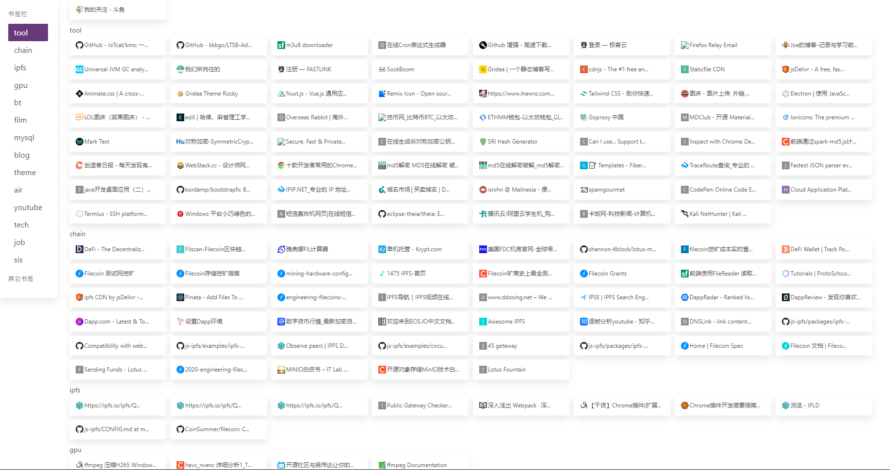

## imark 

chrome 书签插件

#### 构建工具

`nodejs`, `vitejs`, `yarn`

#### 依赖

`bulma`css

#### 开始使用

克隆本仓库，进入项目文件夹，运行以下命令：

`yarn` 

`yarn build` 

`dist`目录下会生成`imark`文件夹即插件

#### 功能

书签列表

右键删除书签

#### 缺陷

只支持1级自定义目录，即 `书签栏` > `自定义目录` > `书签`

#### preview

